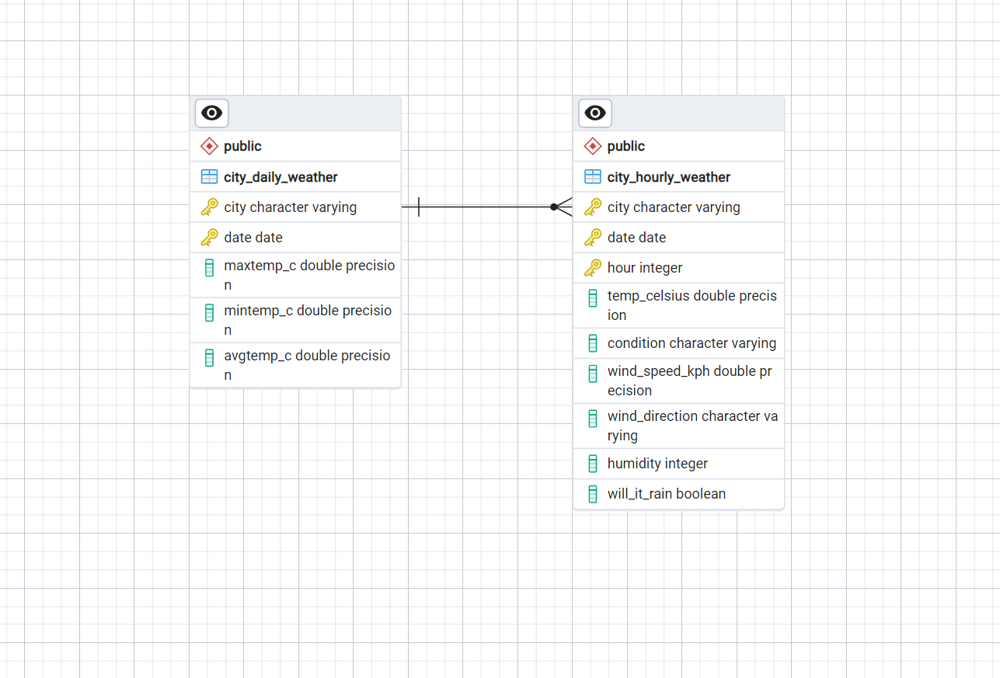
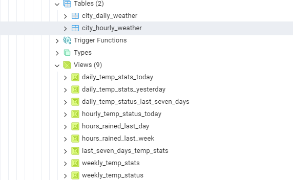
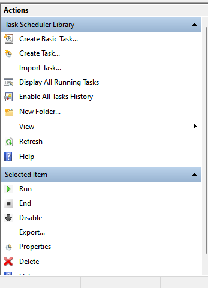
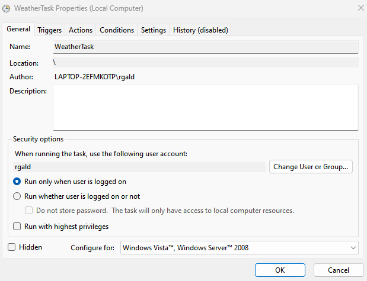
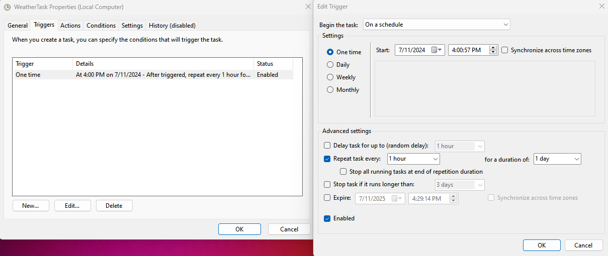
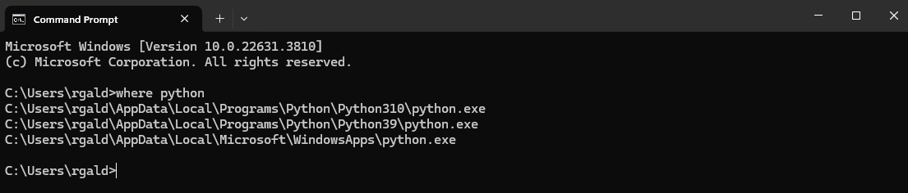
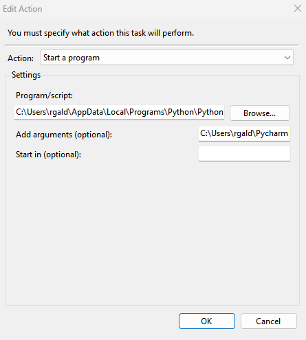

# Weather Data System

The objective of this project is to automate the acquisition, storage,
and analysis of hourly weather data for the twenty largest cities in Europe.

The project encompasses the following key tasks:

1. Data Acquisition:

- Retrieve hourly weather data from an external API for the twenty largest cities in Europe.
- Collect both historical and forecasted weather data to ensure comprehensive coverage.

2. Data Storage:
- Store the acquired weather data in a structured SQL database.
- Design and maintain database tables to effectively manage and query the data.

3. Data Processing:

- Process and clean the retrieved data to ensure accuracy and consistency.
- Create views and aggregate functions within the database for efficient data analysis.

4. Task Scheduling:

- Implement a task scheduler to run the data acquisition and processing scripts at scheduled intervals.
- Ensure the automation of data retrieval and storage to keep the database up-to-date with the latest weather information.

## Project Workflow
1. Setup Environment:

- Set up the necessary Python environment and dependencies.
- Configure the SQL database and create the required tables and views.

2. Data Retrieval:

- Utilize Python scripts to fetch weather data from the API.
- Parse and extract relevant information from the API responses.

3. Data Ingestion:

- Load the extracted data into the SQL database.
- Ensure data integrity and handle potential errors during the ingestion process.

4. Automation:

- Schedule the Python scripts to run automatically at specified times using task scheduling tools.
- Ensure the scheduler is correctly configured to handle different time intervals for historical and forecasted data.

## Setup Instructions
Follow these steps to set up and run the project:

1. Clone the Repository type`https://github.com/TuringCollegeSubmissions/rgaldi-DE2v2.2.5` in bash
2. CD to rgaldi-DE2v2.2.5
3. Set Up Database Connection Settings
4. Create a file named `db_conn_settings.py` in the root directory of the project.
5. Inside this file, define the following variables with your database connection details:
python

### db_conn_settings.py

`DB_USERNAME = "your_database_username"`

`DB_PASSWORD = "your_database_password"`

`DB_HOST = "your_database_host"`

`DB_PORT = "your_database_port"`

`DB_NAME = "your_database_name"`

### proj_var.py
`import os`

`from db_conn_settings import DB_NAME, DB_PORT, DB_HOST, DB_PASSWORD, DB_USERNAME`

`from sqlalchemy import create_engine`

`ENGINE = create_engine(f'postgresql://{DB_USERNAME}:{DB_PASSWORD}@{DB_HOST}:{DB_PORT}/{DB_NAME}')`

`DAYS = 7`

`BASE_PATH = 'YOUR_PATH/rgaldi-DE2v2.2.5'`

`
WEATHER_H_URL = 'http://api.weatherapi.com/v1/history.json'
WEATHER_F_URL = 'http://api.weatherapi.com/v1/forecast.json'
W_API_KEY = 'YOUR_API_KEY'`

`DIRECTORIES = {
    "daily_forecast": os.path.join(BASE_PATH, 'daily_data', 'forecast'),
    "daily_historical": os.path.join(BASE_PATH, 'daily_data', 'historical'),
    "hourly_forecast": os.path.join(BASE_PATH, 'hourly_data', 'forecast'),
    "hourly_historical": os.path.join(BASE_PATH, 'hourly_data', 'historical'),
}`

`LIST_OF_CITIES = [
    'Istanbul',
    'London',
    'Saint Petersburg',
    'Berlin',
    'Madrid',
    'Kyiv',
    'Rome',
    'Bucharest',
    'Paris',
    'Minsk',
    'Vienna',
    'Warsaw',
    'Hamburg',
    'Budapest',
    'Belgrade',
    'Barcelona',
    'Munich',
    'Kharkiv',
    'Milan'
]`
### Install Dependencies
1. Make sure you have Python and pip installed.
2. Then install the required dependencies: Copy code `pip install -r requirements.txt`
3. Run the `main.py` script to execute the project.
4. Set up logging in `logging_config.py`
5. Follow the instructions and messages printed to the logging file for further guidance.

### ERD

### Views

### Task Scheduler Set-up
- Create Task

- Give name to your task

- Schedule the task to run at specified times

- Find your python path

- Enter your python path (program/script)
- Enter path to main.py (Add arguments)

